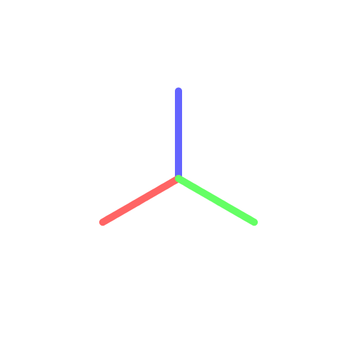
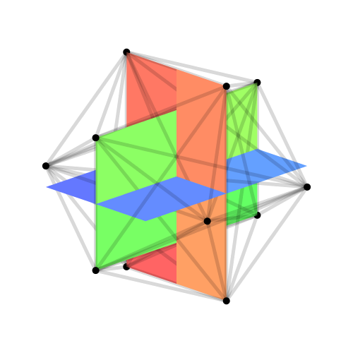

# cornea

Cornea is a library for 3D graphing and rendering in Haskell.

Here's an example:

```haskell
import Cornea
import Codec.Picture (PixelRGBA8 (..), writePng)

axes :: World
axes = [ ( Edge [[0,0,0], [15, 0, 0]] , mark (PixelRGBA8 255 100 100 255) 1)
       , ( Edge [[0,0,0], [ 0,15, 0]] , mark (PixelRGBA8 100 255 100 255) 1)
       , ( Edge [[0,0,0], [ 0, 0,15]] , mark (PixelRGBA8 100 100 255 255) 1)
       ]

main :: IO ()
main = do
  writePng "/tmp/axes.png" $ render 500 500 10 $ axes `seenFrom` isometric
```



And here's a more contrived example. You can see the full source in `app/Main.hs`.



## Usage

Cornea uses
[Graphics.Rasterific](https://hackage.haskell.org/package/Rasterific) under the
hood to draw and style things, so each object to be drawn is a tuple; the first
bit is the point or set of points to draw, and the second is a `Style of type`

```haskell
type Style = ([Primitive] -> Drawing PixelRGBA8 ())
```

typically this will be something like `withTexture (uniformTexture <color>) .
fill` or `withTexture (uniformTexture <color>) . stroke <thickness> JoinRound
(CapRound, CapRound)`, so Cornea provides `solid <color>` and `mark <color>
<thickness>`, which are shorter ways to write the same thing.

The object itself is easy to define.

```haskell
data Obj = Cord [Float] | Edge [[Float]] | Face [[Float]] 
```

The only difference between an Edge and a Face is whether it draws a `polyline`
or `polygon` (Rasterific primitives) under the hood. Both can be styled however
which way.
